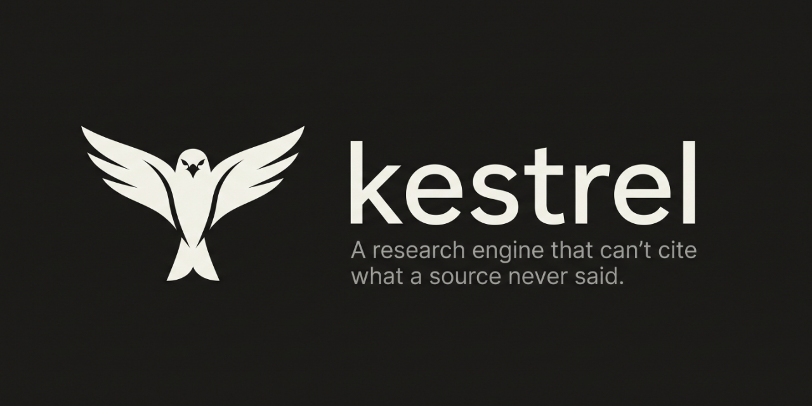

<div align="center">



# kestrel

<sub>`dsh-deep-research` · a DeepSeek Harness plugin and standalone library · zero runtime dependencies</sub>

[](LICENSE)
[](#verification)
[](package.json)
[](https://github.com/topics/dsh-plugin)

**[Quick start](#quick-start) · [Run the demo](#see-it-work-60-seconds) · [How it works](#the-five-mechanisms) · [Tools](#the-five-tools) · [Architecture](#architecture)**

</div>

---

## The problem

Every AI research tool optimizes for **plausible prose with URLs attached**. That produces four failures no amount of prompt engineering fixes:

| | Failure | Reality |
|---|---|---|
| **F1** | *Citation ≠ support* | The cited page frequently does not state the sentence attached to it. Nobody checks entailment; a URL near a claim is treated as proof. |
| **F2** | *Fake corroboration* | "12 sources agree" is usually **one press release and eleven syndications**. Source *count* is used as a truth proxy; independence is never computed. |
| **F3** | *Confirmation-only search* | Queries are seeded from the hypothesis, so the agent searches for support and never for refutation. |
| **F4** | *Slop contamination* | AI-generated affiliate blogs rank equal to primary sources, with no credibility model to separate them. |

Kestrel attacks all four **mechanically** — with code a language model cannot talk its way past.

---

## The two ideas that matter

### 1. A fabricated quote fails `indexOf`

Every citation must carry a **verbatim quote**. Before it is admitted, Kestrel performs a literal substring check against the stored source text, then projects the match back to exact character offsets.

```
quote ∈ document ?  ✓ citation admitted, with [charStart, charEnd]
                 ✗  ✗ REJECTED → claim demoted to UNVERIFIED
```

No model is asked whether the citation is good. Asking the thing that hallucinates to check its own hallucination is circular. **`String.indexOf` is not.**

The judge is *required* to return a quote, and that quote is then verified by code. A dishonest model cannot manufacture support — it can only fail the gate.

### 2. Corroboration is counted in *origins*, not documents

MinHash → LSH candidate filtering → lineage DAG → Tarjan SCC condensation → count the roots. Edge direction is fixed by `min(publishedAt, waybackFirstSeen)`, because publishers rewrite their own dates and the archive is the one timestamp they do not control.

Twelve outlets running the same wire copy is **one** witness, and Kestrel reports it as one.

---

## See it work (60 seconds)

No API key. No network. No configuration.

```bash
git clone https://github.com/grloper/dsh-deep-research.git
cd dsh-deep-research
npm run demo
```

The demo runs the **real pipeline** over a fixed corpus: one press release, six verbatim syndications, four derivative rewrites, one independent regulatory filing, and one correction that retracts the headline number.

### Actual output

**1 · A fabricated quote cannot pass**

```
ADMITTED  (genuine) "its Q3 revenue reached 42 million dollars"
          kind=EXACT span=[40,81] · Quote appears verbatim in the source document.

REJECTED  (fabricated) "its Q3 revenue reached 91 million dollars"
          kind=FAILED span=[-1,-1] · Quote does not appear in the source document
          (best token overlap 0.75 < 0.85). The citation is fabricated.
```

The fabrication differs from the truth by **one digit** — `42` → `91`. Token overlap is 0.75, high enough to fool any similarity threshold a naive tool would pick. The exact-match gate rejects it anyway.

**2 · Thirteen "sources" are three witnesses**

```
Raw source count      : 13
Independent origins   : 3
Derivation edges      : 55

13 sources → 3 independent origins (10 derivative/syndicated)
```

Every source-counting tool reports "13 sources agree." Three actually do.

**3 · A contradiction is surfaced, not buried**

```
2 check-worthy claims · 1 supported · 2 fabricated citation(s) blocked (8%)

SUPPORTED      89% confidence  ICS 2 / 12 sources
  Northwind Robotics reported Q3 revenue of 42 million dollars.
  └ [EXACT] "Northwind Robotics announced today that its Q3 revenue reached 42 millio…"

PARTIAL        40% confidence  ICS 1 / 11 sources
  Northwind Robotics grew 18 percent year over year.
```

Eleven sources "support" the 18% growth claim. One primary filing retracts it. Confidence is **capped at 40% by the contradiction** rather than inflated by the crowd — the opposite of what majority-vote retrieval does.

**4 · The second run does not start from zero**

```
Evidence store backend : sqlite
Claims retained        : 2 across 3 entities

Recall "Northwind revenue" → 2 prior finding(s):
  · SUPPORTED (89%) fresh — Northwind Robotics reported Q3 revenue of 42 mil…
  · PARTIAL  (40%) fresh — Northwind Robotics grew 18 percent year over year.
```

---

## Quick start

### Install into DeepSeek Harness

```bash
npm install dsh-deep-research
npm run install:dsh      # links the plugin into your DSH web/dev profiles
```

Then ask your agent naturally:

> *"Deep research: did the EU AI Act's foundation-model rules change after the 2024 trilogue?"*
> *"Verify this article before I cite it."*
> *"Are these six URLs actually independent sources?"*

### Use it as a library

Every mechanism is an exported, dependency-free module:

```js
import { anchorQuote, analyzeLineage, verifyText } from 'dsh-deep-research'

// Mechanical citation gate
const anchor = anchorQuote('revenue reached 42 million dollars', sourceText)
if (!anchor.ok) throw new Error(anchor.reason)
console.log(anchor.charStart, anchor.charEnd)   // exact, replayable offsets

// Independence analysis
const { ics, total, roots, circular } = analyzeLineage(documents)
console.log(`${total} sources → ${ics} independent origins`)
```

---

## The five tools

Registered automatically with the host agent.

| Tool | What it does |
|---|---|
| **`verify_text`** | Fact-checks any block of text claim by claim. Extracts atomic claims, searches for supporting *and* refuting evidence, and admits a citation only when its quote is mechanically located in the fetched source. |
| **`deep_research`** | Full adversarial investigation. Decomposes the question, runs a prosecutor hunting disconfirming evidence alongside a defender, and iterates with gap-targeted follow-ups until findings converge. Modes: `quick`, `standard`, `deep`, `forensic`. |
| **`compare_sources`** | Given several URLs on one story, determines how many are genuinely independent. Detects verbatim syndication, derivative rewrites, quote propagation, and circular citation. |
| **`check_source`** | Assesses a single URL: source type, credibility signals with reasons, content-quality signals, and publication-date reliability including rewritten-date detection. |
| **`research_recall`** | Queries the accumulated evidence graph, excluding findings that have gone stale under their volatility horizon. Use it *before* researching to avoid repeating work. |

---

## The five mechanisms

### M1 · Mechanical citation anchoring

Three tiers, strictest first: **EXACT** (byte-identical), **NORMALIZED** (identical after whitespace/punctuation folding, projected back to original offsets), and **FUZZY** (token-Jaccard ≥ 0.85, reported distinctly so callers can be strict). A quote shorter than 24 characters is refused outright, because short strings match by coincidence.

Documents are SHA-256 hashed at fetch time. If stored text no longer matches its hash, every citation resting on it is rejected as an integrity failure.

### M2 · Independent Corroboration Score

3-gram shingles → 128-permutation MinHash → LSH banding → pairwise Jaccard. Above `0.85` a document is a **syndication**; above `0.40` with a shared quote of 50+ characters it is a **derivation**. Tarjan's algorithm condenses cycles, and the DAG roots are counted as the true origins. Circular citation loops are reported explicitly.

### M3 · Adversarial tribunal

For every claim, a **prosecutor** generates refutation-seeking queries (`"<claim>" debunked OR false OR retracted`) while a **defender** seeks support. Both sides' evidence passes the same mechanical gate. A claim only reaches `SUPPORTED` when the defense survives the prosecution — and an active contradiction hard-caps confidence regardless of how many sources agree.

### M4 · Date resolution

JSON-LD, Open Graph, meta tags, HTTP headers, and URL path segments are cross-checked. Disagreement between a page's self-reported date and its archival first-sighting is surfaced as a warning, defeating retro-dated edits.

### M5 · Compounding evidence graph

Verified claims persist in a local store (`node:sqlite` when available, transparent JSON fallback otherwise) with BM25 + entity-index + RRF hybrid retrieval. Freshness is **per-claim by volatility class** — a mathematical constant and a stock price must not expire on the same schedule.

| Class | Horizon | Example |
|---|---|---|
| `IMMUTABLE` | 5 years | founding dates, theorems, DOIs |
| `SLOW` | ~6 months | company structure, policy |
| `FAST` | 24 hours | prices, polls, "current CEO" |

---

## Architecture

```
lib/
├── index.js        Host plugin: tool registration, service adapters, Client↔Host RPC
├── client.js       Browser half: Verify action, composer toggle, settings dashboard
├── anchor.js       M1 · mechanical citation anchoring + admission gate
├── lineage.js      M2 · MinHash/LSH/SCC independence analysis
├── tribunal.js     M3 · prosecutor/defender adjudication
├── dates.js        M4 · multi-signal publication-date resolution
├── store.js        M5 · evidence store, volatility classes, freshness
├── graph.js        M5 · BM25 + entity + RRF hybrid recall
├── credibility.js  source typing, credibility and slop signals
├── verify.js       verify_text pipeline
└── research.js     deep_research loop, coverage assessment, gap queries
```

**Design constraints, deliberately chosen:**

- **Zero runtime dependencies.** Nothing to audit, nothing to break, no supply chain.
- **Every capability is injected.** Search, fetch, and LLM arrive through adapters, so the whole engine is testable offline and degrades to heuristics rather than crashing when a host service is missing.
- **The browser never adjudicates.** A page cannot fetch and anchor sources, so it never renders a verdict it did not receive from the host engine. When the host is unreachable the UI says so instead of guessing.

---

## Verification

```bash
npm test        # 218 tests
npm run demo    # end-to-end proof, offline
npm run bench   # throughput and scaling benchmark
```

The suite covers the anchoring tiers, lineage/SCC condensation, tribunal adjudication, date resolution, credibility scoring, store/freshness behaviour, graph recall, RPC contracts, and the plugin's degradation under missing, partial, and hostile host services.

Notable regression guards:

- A **fabricated quote is rejected even when the judge asserts `SUPPORTED`.**
- A **`NEUTRAL` source never becomes a citation** — a source that does not address the claim is not evidence for it.
- **200,000 distinct URLs produce zero id collisions**, protecting a store designed to accumulate for years.
- **Fuzzy anchoring stays linear**; the incremental sliding window replaced an O(document × quote) scan and cut a 40k-token match from ~290 ms to ~45 ms.

> If a test run needs to avoid per-file process spawning (restricted sandboxes, some CI images), use `npm run test:serial`.

---

## Configuration

```js
apply(ctx, {
  storePath: '~/.dsh/kestrel/evidence.db',  // ':memory:' for ephemeral
  maxSources: 6,                            // sources gathered per claim
  defaultMode: 'standard',                  // quick | standard | deep | forensic
  localLlm: false,                          // opt-in local sidecar fast path
  localLlmModel: 'qwen2.5-coder',
})
```

The local-model fast path is **off by default** and self-disabling: a research tool should not send prompt text to a local port nobody configured, and one failed probe latches it off for the process rather than paying a timeout on every call.

---

## Limitations

Stated plainly, because a verification tool that oversells itself is self-refuting:

- **Anchoring proves quotation, not truth.** A source can be quoted perfectly and still be wrong. Kestrel reports *what the evidence says and how independent it is*, not ground truth.
- **Entailment quality depends on the host LLM.** The mechanical gate makes a fabricated quote impossible; it does not make a bad judgement impossible.
- **Independence detection is textual.** Two outlets that independently interview the same source produce different text and will count as two origins.
- **Without a search service the engine degrades to heuristics.** It will tell you so rather than pretend.

---

## The name

A kestrel hunts by hovering — holding station in the air, dead still, until it
sees exactly what is there. Then it commits, once.

That is the opposite of how research agents usually behave: grab the first ten
results, summarize confidently, attach URLs. This engine is built to hold
position over the evidence and only strike when the quote is actually there.

The mark is a kestrel in the hover above a line of source text, with one filled
point marking the exact character offset a quote was anchored to.

---

## License

MIT
